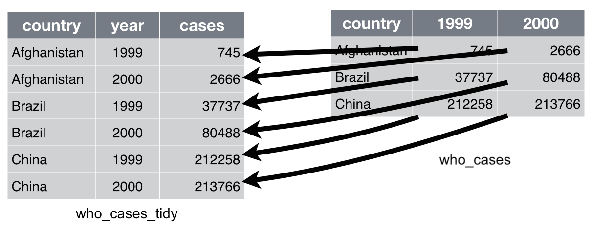

```{r setup, include=FALSE}
knitr::opts_chunk$set(echo = TRUE)
```

# Tidy SNHUsday 

Tidy Tuesday has been going on in the R community for a couple of years now, put on by R for Data Science (here: [:link:](https://github.com/rfordatascience/tidytuesday/)). This is primarily pitched towards R, but the ultimate goal is to start thinking about what is `Tidy` Data and how does it helps us as Data Analysts, Business Analysts, & Data Scientists interpret data & deliver meaningful analysis. Apart from my own reasons for doing this, I want this to be a fun collaborative experience within the Analytics Department & SNHU as a whole(key word is fun!).

## What is Tidy Data

You could look at a majority of our data sources and find very un-tidy data.  A few good examples of this are the student satisfaction surveys(question columns that will forever expand to the right) or even the dreaded `msr_data_final` table(where to begin).  The general idea behind tidied-data is to have each column represent a unique variable, each row represent an unique observation & each cell representing a unique value.


**Example 1**: General concept of tidy data.


**Example 2**: In the example below we are creating a variable `year` out of the columns `1999` & `2000`.


+ Code break down:
  + `who_cases_tidy`: new object we are creating
  + `<-` : R's assignment operator
  + `who_cases` : our un-tidied data frame
  + `%>%` : pipe, read as a `then` statment
    + `pivot_longer` : we use this to pivot our un-tidy columns into tidy ones
      + `cols` is the parameter for our columns to select
      + `names_to`: the new columns name
      + `values_to`: is where we are place the values of the columns of `1999` & `2000`
  
```r
who_cases_tidy <- who_cases %>% 
  pivot_longer(
     cols = c("1999" , "2000")
     names_to = "year",
     values_to = "cases"
  )
```




## Format

The overall format of the meeting will be less than formal.  I really want it to be an open forum where we ask questions and **learn by doing**.  The important part of this is we are able to walk through analysis methodically. 

+ **Logistics**:
  +	Room: Monomoy
  +	When:  Every Other Tuesday (Starting the 11th of February)
  +	Also When: 1-2pm
  +	Attendance: **OPTIONAL**, although it will be fun & we'll make some cool stuff & things :)

<br>

+ **Structure**:
  + New Data Set every other Tuesday
    +	R for Data Science release a new data set every Tuesday.
  + Hour Long sessions with each module being pushed into a github repository
  + Analysis soup to nuts 
    + Pulling in data
    + Cleaning data
    + How to form questions
    + Perform data manipulation to answer questions
    + Perform Statistical tests
    + Building Causal Models 


## Set Up 

### Software

It is entirely possible to do this with Rstudio, Git, and/or Github, but one of the major benefits of Github is the ability to share code with ease. Rstudio has a great integration with Git & Github, so I will be using it to manage these projects as we go forward(if there is a need for a Git & Github class I am happy to sit down). 

+ What to install on your local machine:
  + Install Latest Version of Git [:link:](https://git-scm.com/downloads/) 1st 
  + Install Latest Version of R [:link:](https://cran.r-project.org/bin/windows/base/) 2nd 
  + Install Latest Version of Rstudio [:link:](https://rstudio.com/products/rstudio/download/) 3rd 
  + **Creating a Github account strongly suggested** [:link:](https://github.com/) 4th 
  

### R packages
  
At a bare minimum you will need the `tidyverse` package installed, which is a meta-package that loads 8 individual package all focused on tidy analysis.  We will also be using other packages on the fly, but we will address those as they arrive.

Running the following line of code inside your R environment and it will install all the required packages.

```r
install.packages("tidyverse" , dependencies = TRUE) # meta package that loads 8 packages inside the tidyverse
```


+ `tidyverse` - Meta package that loads the following packages [:link:](https://www.tidyverse.org/).
  + `ggplot2` - is a system for declaratively creating graphics, based on The Grammar of Graphics [:link:](https://ggplot2.tidyverse.org/). 
  + `tibble` - is a modern reimagining of the data.frame [:link:](https://tibble.tidyverse.org/).
  + `tidyr` - is to help you create **tidy data** [:link:](https://tidyr.tidyverse.org/).
  + `readr` - is to provide a fast and friendly way to read rectangular data (like csv, tsv, and fwf) [:link:](https://readr.tidyverse.org/).
  + `purrr` - enhances R’s functional programming (FP) toolkit by providing a complete and consistent set of tools for working with functions and vectors [:link:](https://purrr.tidyverse.org/).
  + `dplyr` - is a grammar of data manipulation, providing a consistent set of verbs that help you solve the most common data manipulation challenges[:link:](https://dplyr.tidyverse.org/).
  + `stringr` - provides a cohesive set of functions designed to make working with strings as easy as possible [:link:](https://stringr.tidyverse.org/).
  + `forcats` - R uses factors to handle categorical variables, variables that have a fixed and known set of possible values  [:link:](https://forcats.tidyverse.org/).
  
