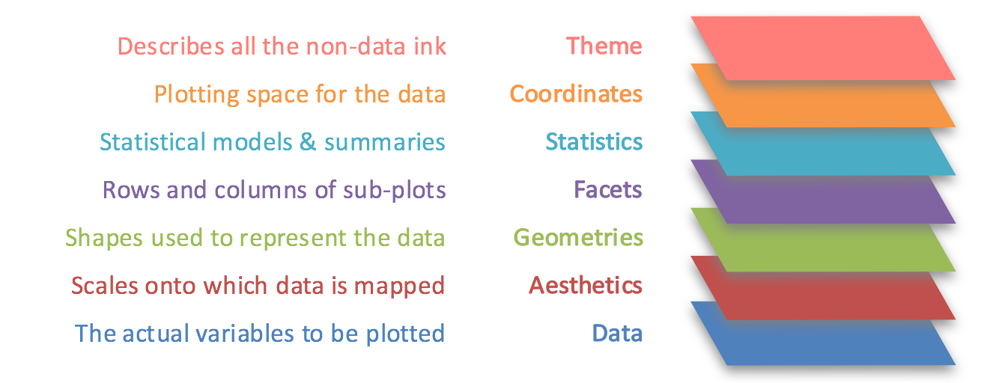

```{r setup, include=FALSE}
knitr::opts_chunk$set(
    echo = TRUE
  , cache = TRUE
  , fig.align = "center"
  , fig.width = 8
  , fig.height = 5
  , dpi = 180
)
```

# Predicting Wine Ratings

In this notebook, we will go over how to import, explore, and model data to understand it.  All of the code & data is open source, but I hope you can take the themes or examples out of this and use it within the business.

## Table of Contents

  - [Set Up](#set-up)
    - [Packages for Part One](#packages-for-part-one) 
    - [Packages for Part Two](#packages-for-part-two)
  - [Part One](#part-one)
    - [Data Pull](#data-pull)
    - [Data Cleaning](#data-cleaning)
    - [Exploratory Data Analysis](#exploratory-data-analysis)
  - [Part Two](#part-one) 
    - [Model Building](#model-building)
    - [Model Evaluation](#model-evaluation)
    - [Text Mining](#text-mining)
      - [GLMNET: How it works](#glmnet:#how-it-works)
      - [Creating a Lexicon](#creating-a-lexicon)


# Set Up

We are going to have to load in a few libraries with R's native command `library`.

## Packages for Part One

In part one of our analysis, the `tidyverse` will be used for our data import, data manipulation, and visualization.

```{r load-packages-1, warning=FALSE, message=FALSE  }
library(tidyverse) # ggplot, tibble, tidyr, readr, purrr, dplyr, stringr, forcats
library(skimr)     # quick data summaries
```


## Packages for Part Two

In part two of our analysis, the packages, `broom`, `Matrix`, `tidytext`, `glmnet`, `doParallel`, will be used for tidying model outputs, tying text data, and then prepping our data for penalized regression.

```{r load-packages-2, warning=FALSE, message=FALSE}
library(broom)     # tidy model outputs
library(tidytext)  # tidy text 
library(Matrix)    # for sparce matrix
library(glmnet)    # penalized regression
library(doParallel)# parallel processing
```

# Part one

## Data Pull

We are going to pull in a data set from a repository on `Github` using `readr`'s function `read_csv()`. 

```{r pull-wine-ratings}
wine_ratings <- read_csv(
  "https://raw.githubusercontent.com/rfordatascience/tidytuesday/master/data/2019/2019-05-28/winemag-data-130k-v2.csv"
)
```
**Note**: Importing with `read_csv()` comes with a message(you'll see this alot) and it basically is telling us that it pulled in our data set and what our function interpreted the data types as.

## Data Cleaning

+ See in the data imported correctly and/or see some of the top rows

```{r check-rows}
head(wine_ratings) # check top 6 observations
tail(wine_ratings) # check bottom 6 observations
```

**Quick summary of data frame**

+ Using `skim()` from the `skimr` package we get a nice overview of our dataframe.
  + We are probably going to have to address the `NA`s(**missing** values in `R`) in the categorical columns: `country`, `designation`, `province`, `region_1`, `region_2`,  `taster_name`, `taster_twitter_handle`, `variety`.
  + Additionally, we could do some type of imputation(fancy way of saying fill in or replace) the `NA` values in the `price` column. 
    + We also see that the our column `points` is normally distributed(good for a linear model), but our column `price` is heavily skewed(might want to transform it).

```{r summarize-df}
skim(wine_ratings) # quickly summarize our data frame
```


**Data Cleanup**
  
+ Model's don't deal with `NA`s or missing values very well, so:
  + For *categorical*, values we want to replace that `NA` with a character value of **missing** or **unknown**(the absence of information is information).
  + For *numeric* columns, there are loads of options like mean, median imputation or even some more advance techniques that I will talk about at some other time.
+ The `title` column also has some useful information that we will want to extract out of it for instance `year`.

**Power of the Pipe a code-breakdown**

+ The `%>%` or **Pipe** is the logical equivalent to a **then** statement... So, why is the unbelievably awesome?  As humans, we tend to work in a very procedural way, we take `thing` **then** do `other thing`... rinse and repeat
  + we want to create a new object `wine_df` and `<-` assign  `wine_ratings` **then** `%>%`
    + remove `X1` `select()` **then** `%>%`
    + replace our `NA`s `replace_na()` **then** `%>%`
    + pull year out of our `title` column `extract()` **then** `%>%`
    + change any weird `year` to values(3000 bc...) to `NA` with `mutate()` **then** `%>%`
    + remove any observations that don't have a price or points rating `filter()` **then** `%>%`
    + create a unique id column with `mutate()`


```{r process-df}
wine_df <- wine_ratings %>% 
  select(-X1) %>% 
  replace_na(
    list(
      country = "missing",
      province = "missing",
      taster_name = "missing"
      )
  ) %>% 
  extract(col = title, into = "year", regex = "(\\d\\d\\d\\d)", convert = TRUE, remove = FALSE) %>% 
  mutate(year = ifelse(year > 2025, NA, year),
         year = ifelse(year < 1970, NA, year)) %>% 
  filter(
    !is.na(price),
    !is.na(points),
    !is.na(year),
    year > 1999
  ) %>% 
  mutate(
    wine_id = row_number()
  )
  
```

Boom... data cleaning... pretty much done... almost


## Exploratory Data Analysis

One of `tidyverse`'s/`R`'s best feature is the `ggplot2` package, which stands for the grammar of graphics ...2(the prophet Hadley retire the first iteration). 

**Why is the grammar of graphics awesome?**
 
 + It allows us to quickly create production level graphs by continuously adding layers.
 + There are three mandatory things  *Data*, *Aesthetics*, & *Geometries* we need to define from `ggplot2` perspective, but we have control to or add the other layers when needed(*Facets*, *Statistics*, *Coordinates*, & `Theme`)



We will want to start making some plots to start understanding our data. One of the goals for this analysis is making a model(s) to predict the wine rating(`points`) of individual reviews(which is also why we cleaned the data).

**Things to explore:**

+ plot distribution of `points`
+ plot distribution of `price`
+ plot count of reviews over time
+ plot anything else you can think of


**GGplot in action a code breakdown:**

+ plot distribution of points
  + we take our data `wine_df` then `%>%`
  + use the `ggplot()` and 
  + give an aesthetic `aes()` and add `+` 
  + a geometry `geom_histogram()` and add `+`
  + (optional) a theme `theme_minimal()` and add `+`
  + (optional) a title `labs()`

```{r}
# check the distribution of points
wine_df %>%
    ggplot(aes(x = points)) + 
    geom_histogram( binwidth = 1) + 
    theme_minimal() + 
    labs(
      title = "Wine Ratings(Points) are normally Distributed",
      subtitle = "",
      caption = "*Having a normal distribution for our target variable is good for a linear model",
      y = "Count",
      x = "Wine Rating"
    )
```

+ plot distribution of `price`
  + Notice how the distribution is heavily skewed.  From a modeling standpoint we would want to scale that variable to see if it is *Log Normally Distributed*.
    + Why does that help? 
      + Certain types of models operated off of assumptions, in this case, the linear model we want to use demands that our dependent variable(`points`) needs to be normally distribute.  It also operates best when our independent variable(s)(`price`) are normally distributed as well.

  
```{r}
wine_df %>% 
  ggplot(aes(x = price)) + 
    geom_histogram(bins = 30) +
    theme_minimal()
```
  
  + If we add `+` `scale_x_log10()` to our plot, we see that our price variable is *Log Normally Distributed*.
  
```{r}
wine_df %>% 
  ggplot(aes(x = price)) + 
    geom_histogram(bins = 30) + 
    scale_x_log10() +
    theme_minimal() 
```


+ plot count of reviews over time
  + here we can see the number of reviews in each year.

```{r}
wine_df %>% 
  group_by(year) %>% 
  summarise(count = n()) %>% 
  ggplot(aes(x = year, y = count)) + 
    geom_col() +
    theme_minimal()
```

# Part Two

## Model Building

We have looked at a few variables(even though you should explore more!), but we only have a loose understanding in a uni-variate or by-variate sense.  Modeling allows us to create a better understanding of our data while controlling for several variables.

+ Jordan's views on Modeling:
  + Start Simple: Linear Models such as Ordinary Least Squares regression are great as long as the assumptions are adhered to(see plotting explanations).
  + *"The most that can be expected from any model is that it can supply a useful approximation to reality: All models are wrong; some models are useful"* ~ George Box
    + Models generalize a problem they have variance, but knowing that let's us know how to utilize what they tell us.
  + There is No Free Lunch Theorem: States that without running models and comparing, no algorithm is said to work better than any other.
    + Basically states that there isn't one true model that works well on all problems.
    + You are not going to build a neural net on a data set of 10,000 observations


**Modeling Objectives:**

+ build a linear model
  + dependent variable = points
  + indendent variable = price + country + taster
+ evaluate our model
  + variable significance
  + adjusted r-square
  + anova
  + plot predicted vs. actual 

**Building a linear model a code breakdown:**

+ build a linear model 
  + we will create an object `lm_mod` and assign `<-` `wine_df` then `%>%`
  + change the categorical levels of `country` with `mutate()` & `fct_lump()` then `%>%`
  + model our data with `lm()` with our formula `points` ~ `log2(price)` + `country` + `taster_name` + `year`

```{r}
# train model
lm_mod <- wine_df %>% 
  mutate(
    country = fct_lump(country, n = 5),
    taster_name = fct_lump(taster_name, n = 5)
  ) %>% 
  lm(points ~ log2(price) + country + taster_name + year, data = .) 
```


## Model Evaluation

In this case, we want to build a model that explains the relationship for wine ratings... to do that we will need to know how to evaluate our model.  There are a bunch of different ways for model evalution, some are for model specific performance and others relate more the the model inner workings.  We are using *Ordinary Least Squares* model, so we can use some stock-standard metrics that are good for linear models(some of these are good for non-linear models).  For this exercise, we will be using the `broom` package and its three commands `glance()`, `tidy()`, & `augment()`.

+ evaluate our model
  + adjusted r-square: is great for looking at how well a model explains the variance of our dependent variable.  It is on a  scale from 0-1(higher is better).  We will use `glance()` function to extract the adjusted r-square.
    + In our case, our model explains 42% of our variance.  Not the best in the model in the world ...

```{r}
lm_mod %>% 
  glance() %>% 
  select(adj.r.squared)
```

+ anova: running an anova test will let us see what each of out variables contribute to the r-squared value.  To get the r-square y variable we take the sum of squared error by variable divided by the total of the square error(code `mutate(contribution = sumsq /sum(sumsq))`).  
  + `price`: contributes most of the variance explanation at 37%
  + `taster_name`: contributes only 3.4%
  + `year`: contributes only .68%
  + While `price` works great we might need some better features. 

```{r}
lm_mod %>% 
  anova() %>% 
  tidy() %>% 
  mutate(contribution = sumsq /sum(sumsq))%>% 
  kableExtra::kable()
```

+ variable significance: We can also check for individual variable importance each of our features... Notice, the only non-significant term is `taster_name:Michael Schachner`.	 

```{r}
# check model coefs contribution of variance explanation
lm_mod %>% 
  tidy() %>% 
  mutate(significane = case_when(p.value < .05 ~ "***",
                                 p.value < .1 ~ "*",
                                 TRUE ~ " ")) %>% 
  kableExtra::kable() 
  
```
 
  + One of my favorite plots is the coefficient plot, it is a nice way to see the influence of each one of our model's inputs on the prediction(wine-rating).  

```{r model-check}
# check coeff
lm_mod %>% 
  tidy(conf.int = TRUE) %>% 
  filter(term != "(Intercept)") %>% 
  mutate(term = fct_reorder(term, estimate)) %>% 
  ggplot() + 
    geom_point(aes(x = term, y = estimate)) + 
    geom_errorbar(aes(x = term, ymin = conf.low, ymax = conf.high)) + 
    theme_minimal() + 
    coord_flip() + 
    labs(
      title = "Coefficient Plot",
      subtitle = "Each time price doubles the rating of the wine increases by 2 points",
      x = "",
      y = "Variable estimate"
    )
```

 + plot predicted vs. actual: This is another one of my favorite plots to quickly check how a model is doing.  We are going to use the `augment()` function to add our predicted values to our data set.  
  + A perfect model would line up exactly on a diagnal line, so our model is far from perfect.
 
 
```{r}
# check predictions
lm_mod %>% 
  augment() %>% 
  ggplot() + 
    geom_point(aes(y = points, x = .fitted), alpha = .1) + 
    geom_abline(color = "red") + 
    theme_minimal() + 
    labs(
      title = "Actuals vs Predicted",
      y = "Actuals",
      x = "Predicted"
    )
```
 
 
## Text mining

One column that we haven't really interacted with is the `description` column.  It is a free text column that describes the wine from the wine reviewer's perspective.  How can we use the words within that description to help our prediction?

**Goal**: Use the description column as an input for our model. We are going to be using a few different packages to accomplish our above goal(`tidytext` for breaking down our description column, `glmnet` for penalized regression,`Matrix` because `glmnet` requires a sparse matrix as an input & `doparallel` for parallel processing).

+ tidy text data
+ most used words
+ pre-process data for penalized regression


**Tidy Text a code break-down**: The tidytext package is amazing if you are going to be doing anything from text mining & sentiment scoring to topic modeling.

+ tidy text data
  + we are going to create and object `wine_words_df` and assign `<-` our dataframe `wine_df` and **then** `%>%`
  + unnest our description column(1-row per word) `unnest_tokens()` and **then** `%>%`
  + we want to remove all stop words(is, the, a...) with `anti_join()` and **then** `%>%`
  + remove some additional words with `filter()`

```{r process-text}
# tidy text package
wine_words_df <- wine_df %>%
  unnest_tokens(word, description) %>%
  anti_join(stop_words, by = "word") %>%
  filter(!word %in% c("wine", "drink", "tannins"),
         str_detect(word, "[a-z]"))

# check df 
wine_words_df
```

+ most used words
  + We are going to check the most frequent words.  The cool thing to look at from the plot is the number of descriptors for tast being used.  Although, this is cool to look at, how can we tell what the how negative or positive our words are on our prediction?

```{r}
wine_words_df %>%
  count(word, sort = TRUE) %>%
  head(20) %>%
  mutate(word = fct_reorder(word, n)) %>%
  ggplot(aes(word, n)) +
  geom_col() +
  theme_minimal() + 
  coord_flip() + 
  labs(
    title = "Frequency of words across wine reviews",
    x =  "",
    y = "Count of Word"
  )
```

+ pre-process data for penalized regression
  + **Penalized Regression**: Penalized regression(Lasso, Ridge, & Elastic Net... google at your pleasure), method keeps variables, but contrains them to zero by some penalty(lambda or $\lambda$ if you're greek). 
  + This should be seen as another tool in the tool kit and has a bunch of great uses.  We are going to want to one of the most popular implementations for penalized re


```{r filter-words}
wine_words_filtered_df <- wine_words_df %>%
  distinct(wine_id, word) %>%
  add_count(word) %>%
  filter(n >= 1000)
```


```{r process-matrix}
# matrix package
# put into matrix
wine_word_matrix <- wine_words_filtered_df %>%
  cast_sparse(wine_id, word)

# add wine ids
wine_ids <- as.integer(rownames(wine_word_matrix))

# dependent variable
scores <- wine_df$points[wine_ids]

# add back price
wine_word_matrix_extra <- cbind(wine_word_matrix, log_price = log2(wine_words_df$price[wine_ids]))
```


Now let's run a penalized regression

```{r fit-glmnet}
# doparallel package
# glmnet package 

# set up parallel processing
registerDoParallel(4)

# create a cross validated model
glmnet_mod <- cv.glmnet(
    x = wine_word_matrix_extra
  , y = scores
  , family = c("gaussian")
  , parallel = TRUE
)
```

### GLMNET: How it works

```{r}
# you can see the impact of lambda on terms coefficients
glmnet_mod$glmnet.fit %>%
  tidy() %>%
  filter(term %in% c("rich", "black", "simple", "complex", "vineyard", "concentrated")) %>%
  ggplot(aes(lambda, estimate, color = term)) +
  geom_line() +
  scale_x_log10() +
  geom_hline(lty = 2, yintercept = 0) + 
  theme_minimal() + 
  labs(
    title = "Lambda's impact on Coefficients"
  )

# smaller the penalty the more terms in the model
glmnet_mod$glmnet.fit %>%
  tidy() %>%
  count(lambda) %>%
  ggplot(aes(lambda, n)) +
  geom_line() +
  scale_x_log10() +
  theme_minimal() + 
  labs(
    title = "As Lambda Increases(Our Penalty) the Number of our Terms Decreases",
    y = "Number of Terms",
    x = "Lambda(Penalty)"
  )

# what's the best lambda
plot(glmnet_mod)
```


### Creating a Lexicon

```{r create-lexicon}
lexicon_df <- glmnet_mod$glmnet.fit %>%
  tidy() %>%
  filter(lambda == glmnet_mod$lambda.1se,
         term != "(Intercept)",
         term != "log_price") %>%
  select(word = term, coefficient = estimate)
```


```{r}
lexicon_df %>%
  arrange(coefficient) %>%
  group_by(direction = ifelse(coefficient < 0, "Negative", "Positive")) %>%
  top_n(16, abs(coefficient)) %>%
  ungroup() %>%
  mutate(word = fct_reorder(word, coefficient)) %>%
  ggplot(aes(word, coefficient, fill = direction)) +
  geom_col() +
  coord_flip() +
  theme_minimal() + 
  labs(x = "",
       y = "Estimated effect of the word on the score",
       title = "What words are predictive of a wine's score?")
```


```{r}
wine_words_df %>%
  filter(wine_id %in% sample(unique(wine_id), 2)) %>%
  distinct(word, title, points) %>%
  mutate(wine = paste0(str_trunc(title, 40), " (", points, ")")) %>%
  inner_join(lexicon_df, by = "word") %>%
  mutate(word = fct_reorder(word, coefficient)) %>%
  ggplot(aes(word, coefficient, fill = coefficient > 0)) +
  geom_col(show.legend = FALSE) +
  coord_flip() +
  facet_wrap(~ wine, scales = "free_y") +
  theme_minimal() + 
  labs(title = "How a lasso regression would predict each wine's score",
       subtitle = "Using a lasso regression with an extra term for price",
       x = "",
       y = "Effect on score")
```


