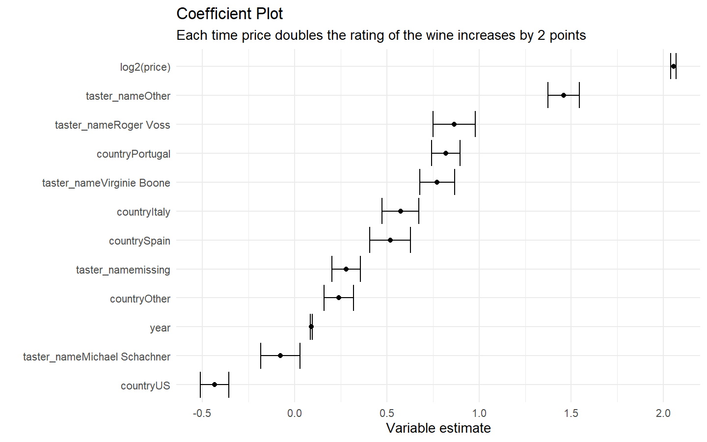
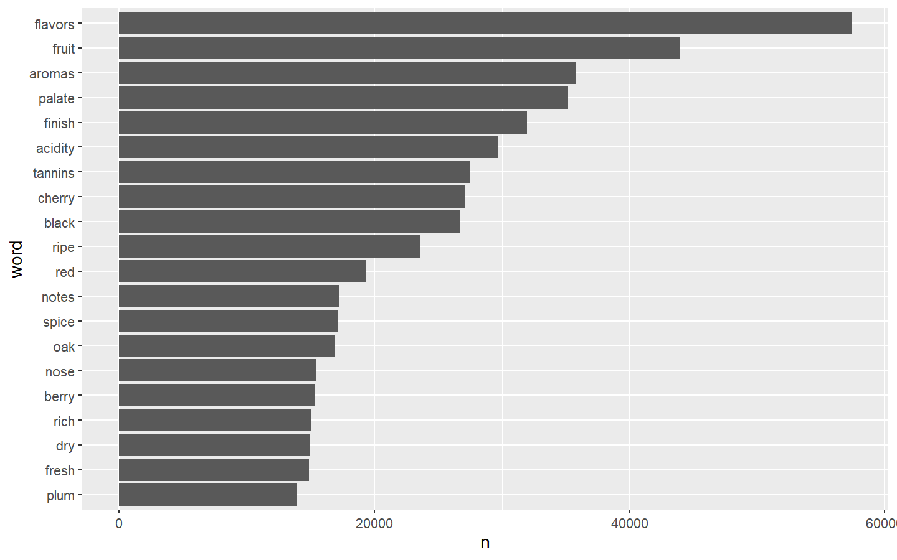

# Set Up

We are going to have to load in a few libraries with R’s native command
`library`.

## Packages for Part One

In part one of our analysis, the `tidyverse` will be used for our data
import, data manipulation, and visualization.

``` r
library(tidyverse) # ggplot, tibble, tidyr, readr, purrr, dplyr, stringr, forcats
```

    ## -- Attaching packages ---------------------------------------------------------------------------------------- tidyverse 1.3.0 --

    ## v ggplot2 3.2.1     v purrr   0.3.3
    ## v tibble  2.1.3     v dplyr   0.8.3
    ## v tidyr   1.0.0     v stringr 1.4.0
    ## v readr   1.3.1     v forcats 0.4.0

    ## -- Conflicts ------------------------------------------------------------------------------------------- tidyverse_conflicts() --
    ## x dplyr::filter() masks stats::filter()
    ## x dplyr::lag()    masks stats::lag()

## Packages for Part Two

In part two of our analysis, the packages, `broom`, `Matrix`,
`tidytext`, `glmnet`, `doParallel`, will be used for tidying model
outputs, tyding text data, and then preppring our data for penalized
regression.

``` r
library(broom)     # tidy model outputs
library(tidytext)  # tidy text 
library(Matrix)    # for sparce matrix
```

    ## 
    ## Attaching package: 'Matrix'

    ## The following objects are masked from 'package:tidyr':
    ## 
    ##     expand, pack, unpack

``` r
library(glmnet)    # penalized regression
```

    ## Loaded glmnet 3.0-1

``` r
library(doParallel)# parallel processing
```

    ## Loading required package: foreach

    ## 
    ## Attaching package: 'foreach'

    ## The following objects are masked from 'package:purrr':
    ## 
    ##     accumulate, when

    ## Loading required package: iterators

    ## Loading required package: parallel

# Part one

## Data Pull

We are going to pull in a data set from a repository on `Github` using
`readr`’s function `read_csv`.

``` r
wine_ratings <- read_csv(
  "https://raw.githubusercontent.com/rfordatascience/tidytuesday/master/data/2019/2019-05-28/winemag-data-130k-v2.csv"
)
```

    ## Warning: Missing column names filled in: 'X1' [1]

    ## Parsed with column specification:
    ## cols(
    ##   X1 = col_double(),
    ##   country = col_character(),
    ##   description = col_character(),
    ##   designation = col_character(),
    ##   points = col_double(),
    ##   price = col_double(),
    ##   province = col_character(),
    ##   region_1 = col_character(),
    ##   region_2 = col_character(),
    ##   taster_name = col_character(),
    ##   taster_twitter_handle = col_character(),
    ##   title = col_character(),
    ##   variety = col_character(),
    ##   winery = col_character()
    ## )

## Clean up data frame

``` r
# Check data frame
head(wine_ratings)
```

    ## # A tibble: 6 x 14
    ##      X1 country description designation points price province region_1 region_2
    ##   <dbl> <chr>   <chr>       <chr>        <dbl> <dbl> <chr>    <chr>    <chr>   
    ## 1     0 Italy   Aromas inc~ Vulkà Bian~     87    NA Sicily ~ Etna     <NA>    
    ## 2     1 Portug~ This is ri~ Avidagos        87    15 Douro    <NA>     <NA>    
    ## 3     2 US      Tart and s~ <NA>            87    14 Oregon   Willame~ Willame~
    ## 4     3 US      Pineapple ~ Reserve La~     87    13 Michigan Lake Mi~ <NA>    
    ## 5     4 US      Much like ~ Vintner's ~     87    65 Oregon   Willame~ Willame~
    ## 6     5 Spain   Blackberry~ Ars In Vit~     87    15 Norther~ Navarra  <NA>    
    ## # ... with 5 more variables: taster_name <chr>, taster_twitter_handle <chr>,
    ## #   title <chr>, variety <chr>, winery <chr>

``` r
tail(wine_ratings)
```

    ## # A tibble: 6 x 14
    ##       X1 country description designation points price province region_1 region_2
    ##    <dbl> <chr>   <chr>       <chr>        <dbl> <dbl> <chr>    <chr>    <chr>   
    ## 1 129965 France  While it's~ Seppi Land~     90    28 Alsace   Alsace   <NA>    
    ## 2 129966 Germany Notes of h~ Brauneberg~     90    28 Mosel    <NA>     <NA>    
    ## 3 129967 US      Citation i~ <NA>            90    75 Oregon   Oregon   Oregon ~
    ## 4 129968 France  Well-drain~ Kritt           90    30 Alsace   Alsace   <NA>    
    ## 5 129969 France  A dry styl~ <NA>            90    32 Alsace   Alsace   <NA>    
    ## 6 129970 France  Big, rich ~ Lieu-dit H~     90    21 Alsace   Alsace   <NA>    
    ## # ... with 5 more variables: taster_name <chr>, taster_twitter_handle <chr>,
    ## #   title <chr>, variety <chr>, winery <chr>

``` r
# check for nas
wine_ratings %>% 
  select(-description) %>% 
  mutate_if(is.character, as.factor) %>% 
  summary()
```

    ##        X1             country            designation        points      
    ##  Min.   :     0   US      :54504   Reserve     : 2009   Min.   : 80.00  
    ##  1st Qu.: 32493   France  :22093   Estate      : 1322   1st Qu.: 86.00  
    ##  Median : 64985   Italy   :19540   Reserva     : 1259   Median : 88.00  
    ##  Mean   : 64985   Spain   : 6645   Riserva     :  698   Mean   : 88.45  
    ##  3rd Qu.: 97478   Portugal: 5691   Estate Grown:  621   3rd Qu.: 91.00  
    ##  Max.   :129970   (Other) :21435   (Other)     :86597   Max.   :100.00  
    ##                   NA's    :   63   NA's        :37465                   
    ##      price               province                     region_1    
    ##  Min.   :   4.00   California:36247   Napa Valley         : 4480  
    ##  1st Qu.:  17.00   Washington: 8639   Columbia Valley (WA): 4124  
    ##  Median :  25.00   Bordeaux  : 5941   Russian River Valley: 3091  
    ##  Mean   :  35.36   Tuscany   : 5897   California          : 2629  
    ##  3rd Qu.:  42.00   Oregon    : 5373   Paso Robles         : 2350  
    ##  Max.   :3300.00   (Other)   :67811   (Other)             :92050  
    ##  NA's   :8996      NA's      :   63   NA's                :21247  
    ##               region_2                taster_name     taster_twitter_handle
    ##  Central Coast    :11065   Roger Voss       :25514   @vossroger  :25514    
    ##  Sonoma           : 9028   Michael Schachner:15134   @wineschach :15134    
    ##  Columbia Valley  : 8103   Kerin O’Keefe    :10776   @kerinokeefe:10776    
    ##  Napa             : 6814   Virginie Boone   : 9537   @vboone     : 9537    
    ##  Willamette Valley: 3423   Paul Gregutt     : 9532   @paulgwine  : 9532    
    ##  (Other)          :12078   (Other)          :33234   (Other)     :28265    
    ##  NA's             :79460   NA's             :26244   NA's        :31213    
    ##                                                      title       
    ##  Gloria Ferrer NV Sonoma Brut Sparkling (Sonoma County) :    11  
    ##  Korbel NV Brut Sparkling (California)                  :     9  
    ##  Segura Viudas NV Extra Dry Sparkling (Cava)            :     8  
    ##  Gloria Ferrer NV Blanc de Noirs Sparkling (Carneros)   :     7  
    ##  Ruinart NV Brut Rosé  (Champagne)                      :     7  
    ##  Segura Viudas NV Aria Estate Extra Dry Sparkling (Cava):     7  
    ##  (Other)                                                :129922  
    ##                      variety                     winery      
    ##  Pinot Noir              :13272   Wines & Winemakers:   222  
    ##  Chardonnay              :11753   Testarossa        :   218  
    ##  Cabernet Sauvignon      : 9472   DFJ Vinhos        :   215  
    ##  Red Blend               : 8946   Williams Selyem   :   211  
    ##  Bordeaux-style Red Blend: 6915   Louis Latour      :   199  
    ##  (Other)                 :79612   Georges Duboeuf   :   196  
    ##  NA's                    :    1   (Other)           :128710

``` r
# check structure  
str(wine_ratings)
```

    ## Classes 'spec_tbl_df', 'tbl_df', 'tbl' and 'data.frame': 129971 obs. of  14 variables:
    ##  $ X1                   : num  0 1 2 3 4 5 6 7 8 9 ...
    ##  $ country              : chr  "Italy" "Portugal" "US" "US" ...
    ##  $ description          : chr  "Aromas include tropical fruit, broom, brimstone and dried herb. The palate isn't overly expressive, offering un"| __truncated__ "This is ripe and fruity, a wine that is smooth while still structured. Firm tannins are filled out with juicy r"| __truncated__ "Tart and snappy, the flavors of lime flesh and rind dominate. Some green pineapple pokes through, with crisp ac"| __truncated__ "Pineapple rind, lemon pith and orange blossom start off the aromas. The palate is a bit more opulent, with note"| __truncated__ ...
    ##  $ designation          : chr  "Vulkà Bianco" "Avidagos" NA "Reserve Late Harvest" ...
    ##  $ points               : num  87 87 87 87 87 87 87 87 87 87 ...
    ##  $ price                : num  NA 15 14 13 65 15 16 24 12 27 ...
    ##  $ province             : chr  "Sicily & Sardinia" "Douro" "Oregon" "Michigan" ...
    ##  $ region_1             : chr  "Etna" NA "Willamette Valley" "Lake Michigan Shore" ...
    ##  $ region_2             : chr  NA NA "Willamette Valley" NA ...
    ##  $ taster_name          : chr  "Kerin O’Keefe" "Roger Voss" "Paul Gregutt" "Alexander Peartree" ...
    ##  $ taster_twitter_handle: chr  "@kerinokeefe" "@vossroger" "@paulgwine " NA ...
    ##  $ title                : chr  "Nicosia 2013 Vulkà Bianco  (Etna)" "Quinta dos Avidagos 2011 Avidagos Red (Douro)" "Rainstorm 2013 Pinot Gris (Willamette Valley)" "St. Julian 2013 Reserve Late Harvest Riesling (Lake Michigan Shore)" ...
    ##  $ variety              : chr  "White Blend" "Portuguese Red" "Pinot Gris" "Riesling" ...
    ##  $ winery               : chr  "Nicosia" "Quinta dos Avidagos" "Rainstorm" "St. Julian" ...
    ##  - attr(*, "spec")=
    ##   .. cols(
    ##   ..   X1 = col_double(),
    ##   ..   country = col_character(),
    ##   ..   description = col_character(),
    ##   ..   designation = col_character(),
    ##   ..   points = col_double(),
    ##   ..   price = col_double(),
    ##   ..   province = col_character(),
    ##   ..   region_1 = col_character(),
    ##   ..   region_2 = col_character(),
    ##   ..   taster_name = col_character(),
    ##   ..   taster_twitter_handle = col_character(),
    ##   ..   title = col_character(),
    ##   ..   variety = col_character(),
    ##   ..   winery = col_character()
    ##   .. )

``` r
wine_df <- wine_ratings %>% 
  select(-X1) %>% 
  replace_na(list(country = "missing", province = "missing", taster_name = "missing")) %>% 
  extract(col = title, into = "year", regex = "(\\d\\d\\d\\d)", convert = TRUE, remove = FALSE) %>% 
  mutate(year = ifelse(year > 2020, NA, year))%>% 
  mutate(year = ifelse(year < 1970, NA, year)) %>% 
  filter(
    !is.na(price),
    !is.na(points),
    !is.na(year),
    year > 1999
  ) %>% 
  mutate(
    wine_id = row_number()
  )
```

# EDA

  - checking distributions
  - extra summary plots

<!-- end list -->

``` r
# check years
wine_df %>%
    ggplot() + 
    geom_histogram(aes(year), binwidth = 1)
```

<!-- -->

``` r
# check dist of points
wine_df %>% 
  ggplot() + 
  geom_histogram(aes(points), binwidth = 1)
```

<!-- -->

``` r
# chekc the price distribution
wine_df %>% 
  ggplot() + 
  geom_histogram(aes(price)) +
  scale_x_log10()
```

    ## `stat_bin()` using `bins = 30`. Pick better value with `binwidth`.

<!-- -->

# Model

``` r
# train model
lm_mod <- wine_df %>% 
  mutate(
    country = fct_lump(country, n = 10)
  ) %>% 
  lm(points ~ log2(price) + country + year, data = .) 
```

``` r
# check coeff
lm_mod %>% 
  tidy(conf.int = TRUE) %>% 
  filter(term != "(Intercept)") %>% 
  mutate(term = fct_reorder(term, estimate)) %>% 
  ggplot() + 
    geom_point(aes(x = term, y = estimate)) + 
    geom_errorbar(aes(x = term, ymin = conf.low, ymax = conf.high)) + 
    coord_flip()
```

<!-- -->

``` r
# check model coefs contribution of variance explanation
lm_mod %>% 
  anova() %>% 
  tidy() %>% 
  mutate(
    contribution = sumsq/sum(sumsq)
  )
```

    ## # A tibble: 4 x 7
    ##   term            df   sumsq    meansq statistic p.value contribution
    ##   <chr>        <int>   <dbl>     <dbl>     <dbl>   <dbl>        <dbl>
    ## 1 log2(price)      1 393626. 393626.      72382.       0       0.371 
    ## 2 country         10  25188.   2519.        463.       0       0.0238
    ## 3 year             1  16009.  16009.       2944.       0       0.0151
    ## 4 Residuals   114997 625375.      5.44       NA       NA       0.590

``` r
# check predictions
lm_mod %>% 
  augment() %>% 
  ggplot() + 
    geom_point(aes(y = points, x = .fitted), alpha = .1) + 
    geom_abline(color = "red")
```

<!-- -->

# Text mining

  - tidy text data
  - most used words
  - which words are good
  - put into matrix form for modeling with glmnet
  - …

<!-- end list -->

``` r
# tidy text package
wine_words_df <- wine_df %>%
  unnest_tokens(word, description) %>%
  anti_join(stop_words, by = "word") %>%
  filter(!word %in% c("wine", "drink"),
         str_detect(word, "[a-z]"))

# check df 
wine_words_df
```

    ## # A tibble: 2,506,319 x 15
    ##    country designation points price province region_1 region_2 taster_name
    ##    <chr>   <chr>        <dbl> <dbl> <chr>    <chr>    <chr>    <chr>      
    ##  1 Portug~ Avidagos        87    15 Douro    <NA>     <NA>     Roger Voss 
    ##  2 Portug~ Avidagos        87    15 Douro    <NA>     <NA>     Roger Voss 
    ##  3 Portug~ Avidagos        87    15 Douro    <NA>     <NA>     Roger Voss 
    ##  4 Portug~ Avidagos        87    15 Douro    <NA>     <NA>     Roger Voss 
    ##  5 Portug~ Avidagos        87    15 Douro    <NA>     <NA>     Roger Voss 
    ##  6 Portug~ Avidagos        87    15 Douro    <NA>     <NA>     Roger Voss 
    ##  7 Portug~ Avidagos        87    15 Douro    <NA>     <NA>     Roger Voss 
    ##  8 Portug~ Avidagos        87    15 Douro    <NA>     <NA>     Roger Voss 
    ##  9 Portug~ Avidagos        87    15 Douro    <NA>     <NA>     Roger Voss 
    ## 10 Portug~ Avidagos        87    15 Douro    <NA>     <NA>     Roger Voss 
    ## # ... with 2,506,309 more rows, and 7 more variables:
    ## #   taster_twitter_handle <chr>, title <chr>, year <int>, variety <chr>,
    ## #   winery <chr>, wine_id <int>, word <chr>

check top words

``` r
wine_words_df %>%
  count(word, sort = TRUE) %>%
  head(20) %>%
  mutate(word = fct_reorder(word, n)) %>%
  ggplot(aes(word, n)) +
  geom_col() +
  coord_flip()
```

<!-- -->

``` r
wine_words_filtered_df <- wine_words_df %>%
  distinct(wine_id, word) %>%
  add_count(word) %>%
  filter(n >= 1000)
```

## which words are good?

  - enter the glmnet

<!-- end list -->

``` r
# matrix package
# put into matrix
wine_word_matrix <- wine_words_filtered_df %>%
  cast_sparse(wine_id, word)

# 
wine_ids <- as.integer(rownames(wine_word_matrix))

# dependent variable
scores <- wine_df$points[wine_ids]

# add back price
wine_word_matrix_extra <- cbind(wine_word_matrix, log_price = log2(wine_words_df$price[wine_ids]))
```

Now let’s run a penalized regression

``` r
# doparallel package
# glmnet package 

# set up parallel processing
registerDoParallel(4)

# create a cross validated model
glmnet_mod <- cv.glmnet(
    x = wine_word_matrix_extra
  , y = scores
  , family = c("gaussian")
  , parallel = TRUE
)
```

## check glmnet

``` r
# you can see the impact of lambda on terms coefficients
glmnet_mod$glmnet.fit %>%
  tidy() %>%
  filter(term %in% c("rich", "black", "simple", "complex", "vineyard", "concentrated")) %>%
  ggplot(aes(lambda, estimate, color = term)) +
  geom_line() +
  scale_x_log10() +
  geom_hline(lty = 2, yintercept = 0) + 
  labs(
    title = "Lambda's impact on Coefficients"
  )
```

<!-- -->

``` r
# smaller the penalty the more terms in the model
glmnet_mod$glmnet.fit %>%
  tidy() %>%
  count(lambda) %>%
  ggplot(aes(lambda, n)) +
  geom_line() +
  scale_x_log10() + 
  labs(
    title = "As Lambda Increases(Our Penalty) the Number of our Terms Decreases",
    y = "Number of Terms",
    x = "Lambda(Penalty)"
  )
```

<!-- -->

``` r
# what's the best lambda
plot(glmnet_mod)
```

<!-- -->

## Creating our own lexicon

``` r
lexicon_df <- glmnet_mod$glmnet.fit %>%
  tidy() %>%
  filter(lambda == glmnet_mod$lambda.1se,
         term != "(Intercept)",
         term != "log_price") %>%
  select(word = term, coefficient = estimate)
```

``` r
lexicon_df %>%
  arrange(coefficient) %>%
  group_by(direction = ifelse(coefficient < 0, "Negative", "Positive")) %>%
  top_n(16, abs(coefficient)) %>%
  ungroup() %>%
  mutate(word = fct_reorder(word, coefficient)) %>%
  ggplot(aes(word, coefficient, fill = direction)) +
  geom_col() +
  coord_flip() +
  labs(x = "",
       y = "Estimated effect of the word on the score",
       title = "What words are predictive of a wine's score?")
```

<!-- -->

``` r
wine_words_df %>%
  filter(wine_id %in% sample(unique(wine_id), 6)) %>%
  distinct(word, title, points) %>%
  mutate(wine = paste0(str_trunc(title, 40), " (", points, ")")) %>%
  inner_join(lexicon_df, by = "word") %>%
  mutate(word = fct_reorder(word, coefficient)) %>%
  ggplot(aes(word, coefficient, fill = coefficient > 0)) +
  geom_col(show.legend = FALSE) +
  coord_flip() +
  facet_wrap(~ wine, scales = "free_y") +
  labs(title = "How a lasso regression would predict each wine's score",
       subtitle = "Using a lasso regression with an extra term for price",
       x = "",
       y = "Effect on score")
```

<!-- -->
