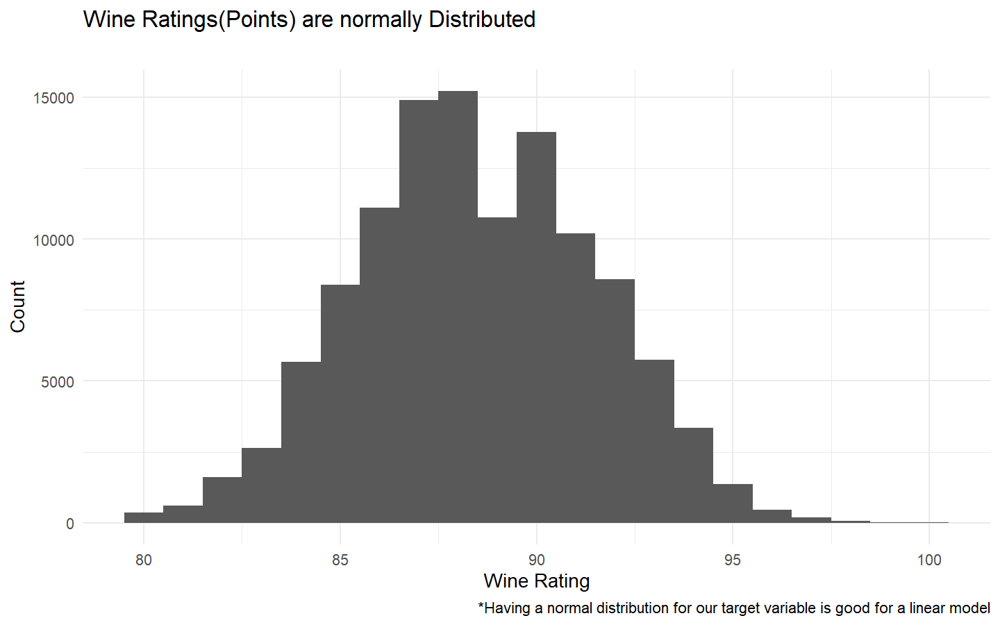
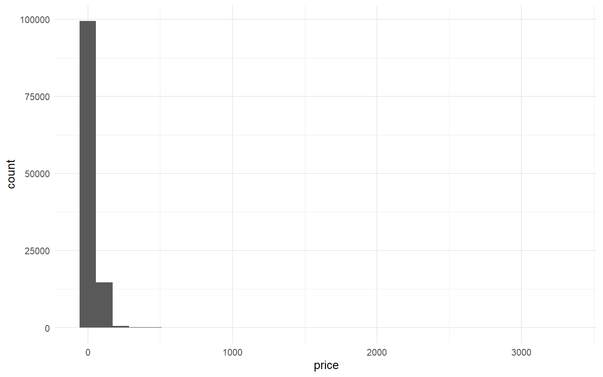
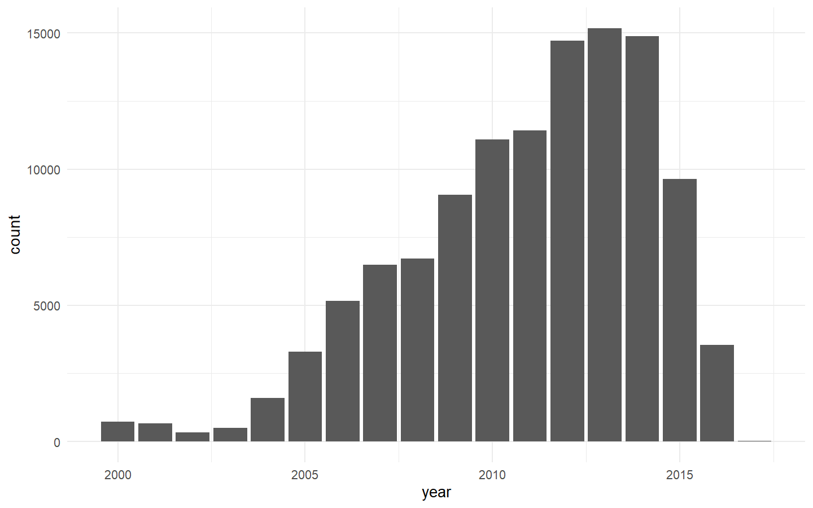
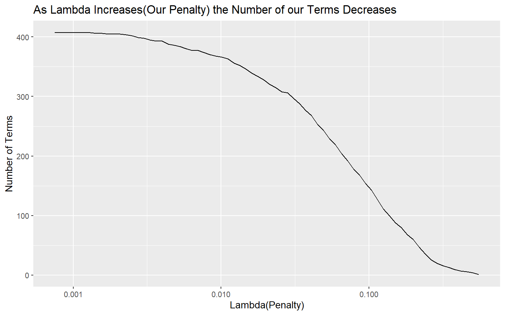
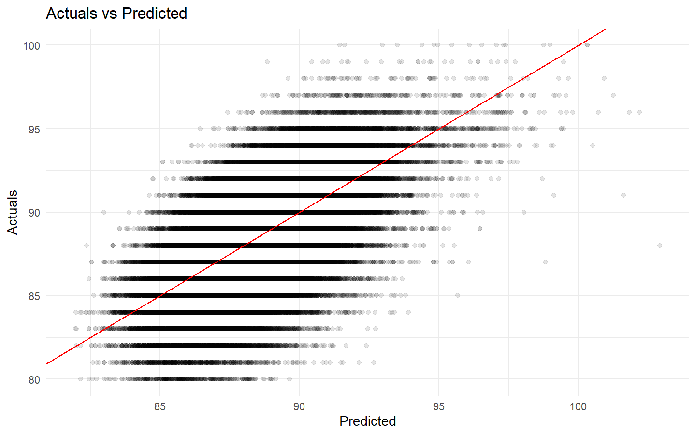

# Predicting Wine Ratings

In this notebook, we will go over how to import, explore, and model data
to understand it. All of the code & data is open source, but I hope you
can take the themes or examples out of this and use it within the
business.


# Set Up

We are going to have to load in a few libraries with R’s native command
`library`.

## Packages for Part One

In part one of our analysis, the `tidyverse` will be used for our data
import, data manipulation, and visualization.

``` r
library(tidyverse) # ggplot, tibble, tidyr, readr, purrr, dplyr, stringr, forcats
library(skimr)     # quick data summaries
```

## Packages for Part Two

In part two of our analysis, the packages, `broom`, `Matrix`,
`tidytext`, `glmnet`, `doParallel`, will be used for tidying model
outputs, tying text data, and then prepping our data for penalized
regression.

``` r
library(broom)     # tidy model outputs
library(tidytext)  # tidy text 
library(Matrix)    # for sparce matrix
library(glmnet)    # penalized regression
library(doParallel)# parallel processing
```

# Part one

## Data Pull

We are going to pull in a data set from a repository on `Github` using
`readr`’s function `read_csv`.

``` r
wine_ratings <- read_csv(
  "https://raw.githubusercontent.com/rfordatascience/tidytuesday/master/data/2019/2019-05-28/winemag-data-130k-v2.csv"
)
```

    ## Warning: Missing column names filled in: 'X1' [1]

    ## Parsed with column specification:
    ## cols(
    ##   X1 = col_double(),
    ##   country = col_character(),
    ##   description = col_character(),
    ##   designation = col_character(),
    ##   points = col_double(),
    ##   price = col_double(),
    ##   province = col_character(),
    ##   region_1 = col_character(),
    ##   region_2 = col_character(),
    ##   taster_name = col_character(),
    ##   taster_twitter_handle = col_character(),
    ##   title = col_character(),
    ##   variety = col_character(),
    ##   winery = col_character()
    ## )

## Data Cleaning

  - See in the data imported correctly and/or see some of the top rows

<!-- end list -->

``` r
head(wine_ratings) # check top 5 observations
```

    ## # A tibble: 6 x 14
    ##      X1 country description designation points price province region_1
    ##   <dbl> <chr>   <chr>       <chr>        <dbl> <dbl> <chr>    <chr>   
    ## 1     0 Italy   Aromas inc~ Vulkà Bian~     87    NA Sicily ~ Etna    
    ## 2     1 Portug~ This is ri~ Avidagos        87    15 Douro    <NA>    
    ## 3     2 US      Tart and s~ <NA>            87    14 Oregon   Willame~
    ## 4     3 US      Pineapple ~ Reserve La~     87    13 Michigan Lake Mi~
    ## 5     4 US      Much like ~ Vintner's ~     87    65 Oregon   Willame~
    ## 6     5 Spain   Blackberry~ Ars In Vit~     87    15 Norther~ Navarra 
    ## # ... with 6 more variables: region_2 <chr>, taster_name <chr>,
    ## #   taster_twitter_handle <chr>, title <chr>, variety <chr>, winery <chr>

``` r
tail(wine_ratings) # check bottom 5 observations
```

    ## # A tibble: 6 x 14
    ##       X1 country description designation points price province region_1
    ##    <dbl> <chr>   <chr>       <chr>        <dbl> <dbl> <chr>    <chr>   
    ## 1 129965 France  While it's~ Seppi Land~     90    28 Alsace   Alsace  
    ## 2 129966 Germany Notes of h~ Brauneberg~     90    28 Mosel    <NA>    
    ## 3 129967 US      Citation i~ <NA>            90    75 Oregon   Oregon  
    ## 4 129968 France  Well-drain~ Kritt           90    30 Alsace   Alsace  
    ## 5 129969 France  A dry styl~ <NA>            90    32 Alsace   Alsace  
    ## 6 129970 France  Big, rich ~ Lieu-dit H~     90    21 Alsace   Alsace  
    ## # ... with 6 more variables: region_2 <chr>, taster_name <chr>,
    ## #   taster_twitter_handle <chr>, title <chr>, variety <chr>, winery <chr>

Quick summary of data frame

  - Using `skim()` from the `skimr` package we get a nice overview of
    our dataframe.
      - We are probably going to have to address the `NA`s(**missing**
        values in `R`) in the categorical columns: `country`,
        `designation`, `province`, `region_1`, `region_2`,
        `taster_name`, `taster_twitter_handle`, `variety`.
      - Additionally, we could do some type of imputation(fancy way of
        saying fill in or replace) the `NA` values in the `price`
        column.
          - We also see that the our column `points` is normally
            distributed(good for a linear model), but our column `price`
            is heavily skewed(might want to transform it).

<!-- end list -->

``` r
skim(wine_ratings) # quickly summarize our data frame
```

|                                                  |               |
| :----------------------------------------------- | :------------ |
| Name                                             | wine\_ratings |
| Number of rows                                   | 129971        |
| Number of columns                                | 14            |
| \_\_\_\_\_\_\_\_\_\_\_\_\_\_\_\_\_\_\_\_\_\_\_   |               |
| Column type frequency:                           |               |
| character                                        | 11            |
| numeric                                          | 3             |
| \_\_\_\_\_\_\_\_\_\_\_\_\_\_\_\_\_\_\_\_\_\_\_\_ |               |
| Group variables                                  | None          |

Data summary

**Variable type: character**

| skim\_variable          | n\_missing | complete\_rate | min | max | empty | n\_unique | whitespace |
| :---------------------- | ---------: | -------------: | --: | --: | ----: | --------: | ---------: |
| country                 |         63 |           1.00 |   2 |  22 |     0 |        43 |          0 |
| description             |          0 |           1.00 |  20 | 829 |     0 |    119955 |          0 |
| designation             |      37465 |           0.71 |   1 |  95 |     0 |     37979 |          0 |
| province                |         63 |           1.00 |   3 |  31 |     0 |       425 |          0 |
| region\_1               |      21247 |           0.84 |   3 |  50 |     0 |      1229 |          0 |
| region\_2               |      79460 |           0.39 |   4 |  17 |     0 |        17 |          0 |
| taster\_name            |      26244 |           0.80 |  10 |  18 |     0 |        19 |          0 |
| taster\_twitter\_handle |      31213 |           0.76 |   6 |  16 |     0 |        15 |          0 |
| title                   |          0 |           1.00 |  12 | 136 |     0 |    118840 |          0 |
| variety                 |          1 |           1.00 |   4 |  35 |     0 |       707 |          0 |
| winery                  |          0 |           1.00 |   1 |  54 |     0 |     16757 |          0 |

**Variable type: numeric**

| skim\_variable | n\_missing | complete\_rate |     mean |       sd | p0 |     p25 |   p50 |     p75 |   p100 | hist  |
| :------------- | ---------: | -------------: | -------: | -------: | -: | ------: | ----: | ------: | -----: | :---- |
| X1             |          0 |           1.00 | 64985.00 | 37519.54 |  0 | 32492.5 | 64985 | 97477.5 | 129970 | ▇▇▇▇▇ |
| points         |          0 |           1.00 |    88.45 |     3.04 | 80 |    86.0 |    88 |    91.0 |    100 | ▂▇▇▂▁ |
| price          |       8996 |           0.93 |    35.36 |    41.02 |  4 |    17.0 |    25 |    42.0 |   3300 | ▇▁▁▁▁ |

Data Cleanup

  - Model’s don’t deal with `NA`s or missing values very well, so:
      - For *categorical*, values we want to replace that `NA` with a
        character value of **missing** or **unknown**(the absence of
        information is information).
      - For *numeric* columns, there are loads of options like mean,
        median imputation or even some more advance techniques that I
        will talk about at some other time.
  - The `title` column also has some useful information that we will
    want to extract out of it for instance `year`.

Power of the **Pipe** a code-breakdown

  - The `%>%` or **Pipe** is the logical equivalent to a **then**
    statement… So, why is the unbelievably awesome? As humans, we tend
    to work in a very procedural way, we take `thing` **then** do `other
    thing`… rinse and repeat
      - we want to create a new object `wine_df` and `<-` assign
        `wine_ratings` **then** `%>%`
          - remove `X1` `select()` **then** `%>%`
          - replace our `NA`s `replace_na()` **then** `%>%`
          - pull year out of our `title` column `extract()` **then**
            `%>%`
          - change any weird `year` to values(3000 bc…) to `NA` with
            `mutate()` **then** `%>%`
          - remove any observations that don’t have a price or points
            rating `filter()` **then** `%>%`
          - create a unique id column with `mutate()`

<!-- end list -->

``` r
wine_df <- wine_ratings %>% 
  select(-X1) %>% 
  replace_na(list(country = "missing", province = "missing", taster_name = "missing")) %>% 
  extract(col = title, into = "year", regex = "(\\d\\d\\d\\d)", convert = TRUE, remove = FALSE) %>% 
  mutate(year = ifelse(year > 2025, NA, year),
         year = ifelse(year < 1970, NA, year)) %>% 
  filter(
    !is.na(price),
    !is.na(points),
    !is.na(year),
    year > 1999
  ) %>% 
  mutate(
    wine_id = row_number()
  )
```

Boom… data cleaning… pretty much done… almost

# Exploratory Data Analysis

One of `tidyverse`’s/`R`’s best feature is the `ggplot2` package, which
stands for the grammar of graphics …2(the prophet Hadley retire the
first iteration).

**Why is the grammar of graphics awesome?**

  - It allows us to quickly create production level graphs by
    continuously adding layers.
  - There are three mandatory things *Data*, *Aesthetics*, &
    *Geometries* we need to define from `ggplot2` perspective, but we
    have control to or add the other layers when needed(*Facets*,
    *Statistics*, *Coordinates*, & `Theme`)


We will want to start making some plots to start understanding our data.
One of the goals for this analysis is making a model(s) to predict the
wine rating(`points`) of individual reviews(which is also why we cleaned
the data).

Things to explore:

  - plot distribution of `points`
  - plot distribution of `price`
  - plot count of reviews over time
  - plot anything else you can think of

GGplot in action a code breakdown:

  - plot distribution of points
      - we take our data `wine_df` then `%>%`
      - use the `ggplot()` and
      - give an aesthetic `aes()` and add `+`
      - a geometry `geom_histogram()` and add `+`
      - (optional) a theme `theme_minimal()` and add `+`
      - (optional) a title `labs()`

<!-- end list -->

``` r
# check the distribution of points
wine_df %>%
    ggplot(aes(x = points)) + 
    geom_histogram( binwidth = 1) + 
    theme_minimal() + 
    labs(
      title = "Wine Ratings(Points) are normally Distributed",
      subtitle = "",
      caption = "*Having a normal distribution for our target variable is good for a linear model",
      y = "Count",
      x = "Wine Rating"
    )
```



  - plot distribution of `price`
      - Notice how the distribution is heavily skewed. From a modeling
        standpoint we would want to scale that variable to see if it is
        *Log Normally Distributed*.
          - Why does that help?
              - Certain types of models operated off of assumptions, in
                this case, the linear model we want to use demands that
                our dependent variable(`points`) needs to be normally
                distribute. It also operates best when our independent
                variable(s)(`price`) are normally distributed as well.

<!-- end list -->

``` r
wine_df %>% 
  ggplot(aes(x = price)) + 
    geom_histogram(bins = 30)
```



  - If we add `+` `scale_x_log10()` to our plot, we see that our price
    variable is *Log Normally Distributed*.

<!-- end list -->

``` r
wine_df %>% 
  ggplot(aes(x = price)) + 
    geom_histogram(bins = 30) + 
    scale_x_log10()
```


  - plot count of reviews over time
      - here we can see the number of reviews in each year.

<!-- end list -->

``` r
wine_df %>% 
  group_by(year) %>% 
  summarise(count = n()) %>% 
  ggplot(aes(x = year, y = count))+ 
    geom_col()
```



# Model Building

We have looked at a few variables(even though you should explore
more\!), but we only have a loose understanding in a uni-variate or
by-variate sense. Modeling allows us to create a better understanding of
our data while controlling for several variables.

  - Jordan’s views on Modeling:
      - Start Simple: Linear Models such as Ordinary Least Squares
        regression are great as long as the assumptions are adhered
        to(see plotting explanations).
      - *“The most that can be expected from any model is that it can
        supply a useful approximation to reality: All models are wrong;
        some models are useful”* \~ George Box
          - Models generalize a problem they have variance, but knowing
            that let’s us know how to utilize what they tell us.
      - There is No Free Lunch Theorem: States that without running
        models and comparing, no algorithm is said to work better than
        any other.
          - Basically states that there isn’t one true model that works
            well on all problems.
          - You are not going to build a neural net on a data set of
            10,000 observations

Modeling Objectives:

  - build a linear model
  - evaluate our model

Building a linear model a code breakdown: + build a linear model

``` r
# train model
lm_mod <- wine_df %>% 
  mutate(
    country = fct_lump(country, n = 10)
  ) %>% 
  lm(points ~ log2(price) + country + year, data = .) 
```

``` r
# check coeff
lm_mod %>% 
  tidy(conf.int = TRUE) %>% 
  filter(term != "(Intercept)") %>% 
  mutate(term = fct_reorder(term, estimate)) %>% 
  ggplot() + 
    geom_point(aes(x = term, y = estimate)) + 
    geom_errorbar(aes(x = term, ymin = conf.low, ymax = conf.high)) + 
    coord_flip()
```


``` r
# check model coefs contribution of variance explanation
lm_mod %>% 
  anova() %>% 
  tidy() %>% 
  mutate(
    contribution = sumsq/sum(sumsq)
  )
```

    ## # A tibble: 4 x 7
    ##   term            df   sumsq    meansq statistic p.value contribution
    ##   <chr>        <int>   <dbl>     <dbl>     <dbl>   <dbl>        <dbl>
    ## 1 log2(price)      1 393626. 393626.      72382.       0       0.371 
    ## 2 country         10  25188.   2519.        463.       0       0.0238
    ## 3 year             1  16009.  16009.       2944.       0       0.0151
    ## 4 Residuals   114997 625375.      5.44       NA       NA       0.590

``` r
# check predictions
lm_mod %>% 
  augment() %>% 
  ggplot() + 
    geom_point(aes(y = points, x = .fitted), alpha = .1) + 
    geom_abline(color = "red")
```


# Text mining

  - tidy text data
  - most used words
  - which words are good
  - put into matrix form for modeling with glmnet
  - …

<!-- end list -->

``` r
# tidy text package
wine_words_df <- wine_df %>%
  unnest_tokens(word, description) %>%
  anti_join(stop_words, by = "word") %>%
  filter(!word %in% c("wine", "drink"),
         str_detect(word, "[a-z]"))

# check df 
wine_words_df
```

    ## # A tibble: 2,506,319 x 15
    ##    country designation points price province region_1 region_2 taster_name
    ##    <chr>   <chr>        <dbl> <dbl> <chr>    <chr>    <chr>    <chr>      
    ##  1 Portug~ Avidagos        87    15 Douro    <NA>     <NA>     Roger Voss 
    ##  2 Portug~ Avidagos        87    15 Douro    <NA>     <NA>     Roger Voss 
    ##  3 Portug~ Avidagos        87    15 Douro    <NA>     <NA>     Roger Voss 
    ##  4 Portug~ Avidagos        87    15 Douro    <NA>     <NA>     Roger Voss 
    ##  5 Portug~ Avidagos        87    15 Douro    <NA>     <NA>     Roger Voss 
    ##  6 Portug~ Avidagos        87    15 Douro    <NA>     <NA>     Roger Voss 
    ##  7 Portug~ Avidagos        87    15 Douro    <NA>     <NA>     Roger Voss 
    ##  8 Portug~ Avidagos        87    15 Douro    <NA>     <NA>     Roger Voss 
    ##  9 Portug~ Avidagos        87    15 Douro    <NA>     <NA>     Roger Voss 
    ## 10 Portug~ Avidagos        87    15 Douro    <NA>     <NA>     Roger Voss 
    ## # ... with 2,506,309 more rows, and 7 more variables:
    ## #   taster_twitter_handle <chr>, title <chr>, year <int>, variety <chr>,
    ## #   winery <chr>, wine_id <int>, word <chr>

check top words

``` r
wine_words_df %>%
  count(word, sort = TRUE) %>%
  head(20) %>%
  mutate(word = fct_reorder(word, n)) %>%
  ggplot(aes(word, n)) +
  geom_col() +
  coord_flip()
```


``` r
wine_words_filtered_df <- wine_words_df %>%
  distinct(wine_id, word) %>%
  add_count(word) %>%
  filter(n >= 1000)
```

## which words are good?

  - enter the glmnet

<!-- end list -->

``` r
# matrix package
# put into matrix
wine_word_matrix <- wine_words_filtered_df %>%
  cast_sparse(wine_id, word)

# 
wine_ids <- as.integer(rownames(wine_word_matrix))

# dependent variable
scores <- wine_df$points[wine_ids]

# add back price
wine_word_matrix_extra <- cbind(wine_word_matrix, log_price = log2(wine_words_df$price[wine_ids]))
```

Now let’s run a penalized regression

``` r
# doparallel package
# glmnet package 

# set up parallel processing
registerDoParallel(4)

# create a cross validated model
glmnet_mod <- cv.glmnet(
    x = wine_word_matrix_extra
  , y = scores
  , family = c("gaussian")
  , parallel = TRUE
)
```

## check glmnet

``` r
# you can see the impact of lambda on terms coefficients
glmnet_mod$glmnet.fit %>%
  tidy() %>%
  filter(term %in% c("rich", "black", "simple", "complex", "vineyard", "concentrated")) %>%
  ggplot(aes(lambda, estimate, color = term)) +
  geom_line() +
  scale_x_log10() +
  geom_hline(lty = 2, yintercept = 0) + 
  labs(
    title = "Lambda's impact on Coefficients"
  )
```


``` r
# smaller the penalty the more terms in the model
glmnet_mod$glmnet.fit %>%
  tidy() %>%
  count(lambda) %>%
  ggplot(aes(lambda, n)) +
  geom_line() +
  scale_x_log10() + 
  labs(
    title = "As Lambda Increases(Our Penalty) the Number of our Terms Decreases",
    y = "Number of Terms",
    x = "Lambda(Penalty)"
  )
```



``` r
# what's the best lambda
plot(glmnet_mod)
```


## Creating our own lexicon

``` r
lexicon_df <- glmnet_mod$glmnet.fit %>%
  tidy() %>%
  filter(lambda == glmnet_mod$lambda.1se,
         term != "(Intercept)",
         term != "log_price") %>%
  select(word = term, coefficient = estimate)
```

``` r
lexicon_df %>%
  arrange(coefficient) %>%
  group_by(direction = ifelse(coefficient < 0, "Negative", "Positive")) %>%
  top_n(16, abs(coefficient)) %>%
  ungroup() %>%
  mutate(word = fct_reorder(word, coefficient)) %>%
  ggplot(aes(word, coefficient, fill = direction)) +
  geom_col() +
  coord_flip() +
  labs(x = "",
       y = "Estimated effect of the word on the score",
       title = "What words are predictive of a wine's score?")
```


``` r
wine_words_df %>%
  filter(wine_id %in% sample(unique(wine_id), 4)) %>%
  distinct(word, title, points) %>%
  mutate(wine = paste0(str_trunc(title, 40), " (", points, ")")) %>%
  inner_join(lexicon_df, by = "word") %>%
  mutate(word = fct_reorder(word, coefficient)) %>%
  ggplot(aes(word, coefficient, fill = coefficient > 0)) +
  geom_col(show.legend = FALSE) +
  coord_flip() +
  facet_wrap(~ wine, scales = "free_y") +
  labs(title = "How a lasso regression would predict each wine's score",
       subtitle = "Using a lasso regression with an extra term for price",
       x = "",
       y = "Effect on score")
```


